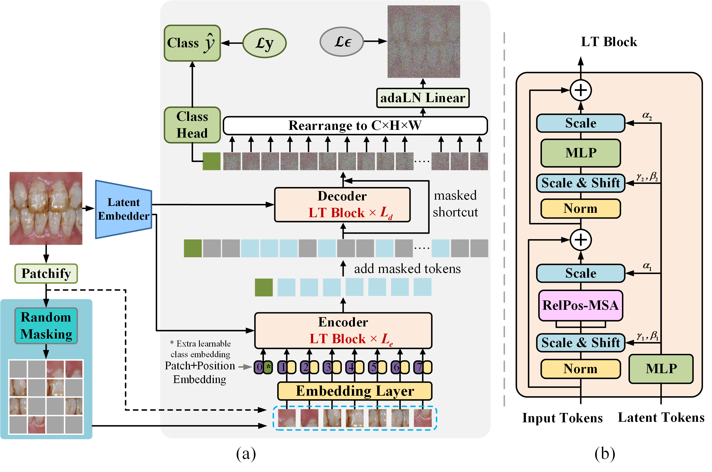
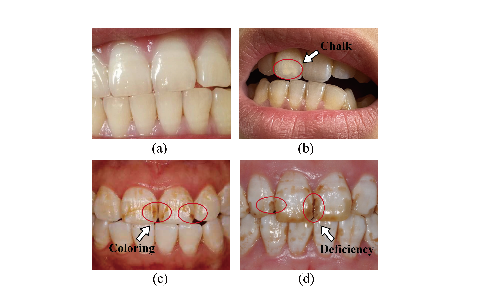

<h1>MLTrMR</h1>
<h3>Masked Latent Transformer with the Random Masking Ratio to Advance the Diagnosis of Dental Fluorosis</h3>

Yun Wu1,2,\*, [Hao Xu](https://github.com/uxhao-o)1,2,\*, :email:, [Jun Xu](https://faculty.nuist.edu.cn/jxu/zh_CN/index.htm)3, Youliang Tian1,2

1  State Key Laboratory of Public Big Data, Guizhou University  
2  College of Computer Science and Technology, Guizhou University  
3 School of Artificial lntelligence, Nanjing University of Information Science and Technology

( \* ) Co-first authors, ( :email: ) Corresponding author.

ArXiv Preprint ([arXiv 2404.13564](https://arxiv.org/abs/2404.13564))

# Notes
- This study has been submitted to `Neural Networks` for review.
- We will publish the code and dataset of MLTrMR in this repository when our paper is accepted.

# Abstract
Dental fluorosis is a chronic disease caused by long-term overconsumption of fluoride, which leads to changes in the appearance of tooth enamel. It is an important basis for early non-invasive diagnosis of endemic fluorosis. However, even dental professionals may not be able to accurately distinguish dental fluorosis and its severity based on tooth images. Currently, there is still a gap in research on applying deep learning to diagnosing dental fluorosis. Therefore, we construct the first open-source dental fluorosis image dataset (DFID), laying the foundation for deep learning research in this field. To advance the diagnosis of dental fluorosis, we propose a pioneering deep learning model called masked latent transformer with the random masking ratio (MLTrMR). MLTrMR introduces a mask latent modeling scheme based on Vision Transformer to enhance contextual learning of dental fluorosis lesion characteristics. Consisting of a latent embedder, encoder, and decoder, MLTrMR employs the latent embedder to extract latent tokens from the original image, whereas the encoder and decoder comprising the latent transformer (LT) block are used to process unmasked tokens and predict masked tokens, respectively. To mitigate the lack of inductive bias in Vision Transformer, which may result in performance degradation, the LT block introduces latent tokens to enhance the learning capacity of latent lesion features. Furthermore, we design an auxiliary loss function to constrain the parameter update direction of the model. MLTrMR achieves 80.19% accuracy, 75.79% F1, and 81.28% quadratic weighted kappa on DFID, making it state-of-the-art (SOTA).

# Overview

# Dental Fluorosis Image Dataset (DFID)

