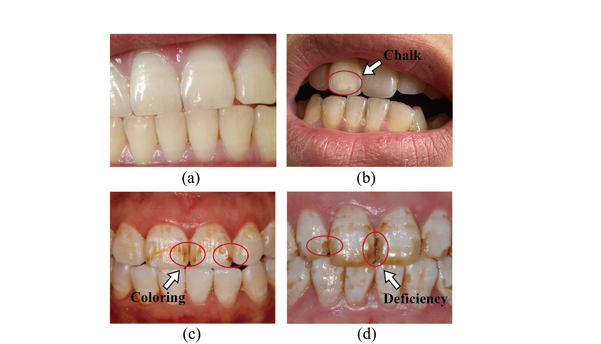

# MLTrMR
Code and dataset for paper "Masked Latent Transformer with the Random Masking Ratio to Advance the Diagnosis of Dental Fluorosis" 

# Note
We will publish the code and dataset of MLTrMR in this repository when our paper is accepted.

# Dental Fluorosis Image Dataset (DFID)

